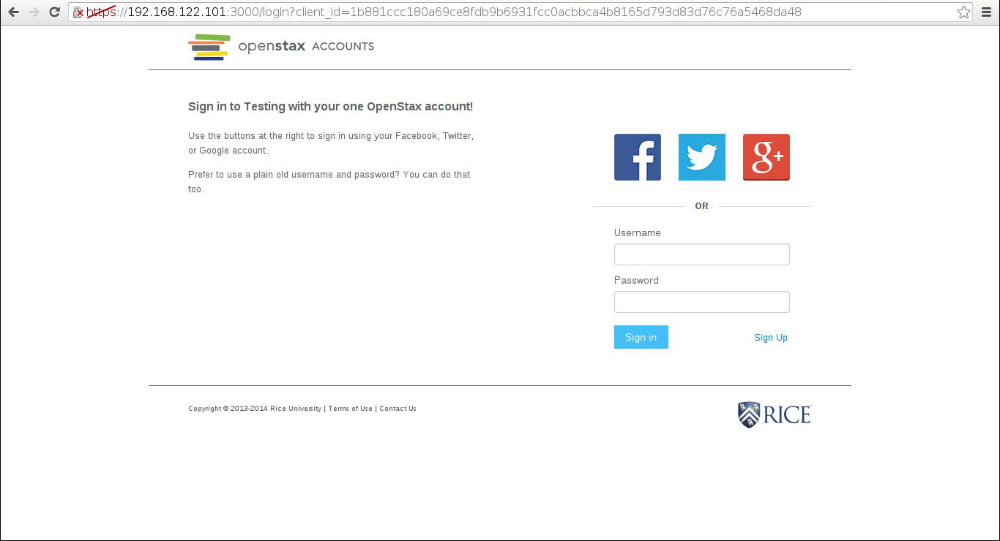

=========================
README for openstax-setup
=========================

Installation
------------

1. Install virtualenv

   ``sudo apt-get install python-virtualenv``

   OR

   Download it from https://pypi.python.org/pypi/virtualenv

2. Set up virtual env

   ``virtualenv .``

3. Install fabric

   ``./bin/pip install fabric``

4. Have a look at what tasks are available:

   ``./bin/fab -l``

Example Usage
-------------

1. Create a VM or have a server with Ubuntu 13.04 (which we will call raring).

2. (Optional) Set up your ssh key and hostname in your ssh config.

3. Set up openstax/services on raring:

   ``./bin/fab -H raring services_setup``

4. Read the output and do some manual setup.

5. Start services (in 2 terminals):

   ``./bin/fab -H raring services_run``

   ``./bin/fab -H raring services_run_ssl``

6. Set up openstax/connect-rails example on raring:

   ``./bin/fab -H raring example_setup``

7. Read the output and do more manual setup.

8. Start example:

   ``./bin/fab -H raring example_run``

9. Go to http://raring:4000 and try to login.

Login page screenshot
---------------------

